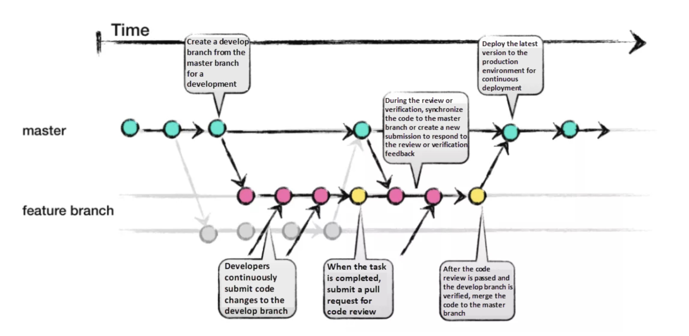
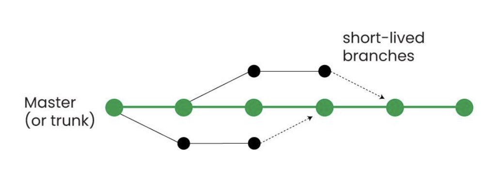

## 브랜치 전략이란?
**브랜치 전략**은 여러 개발자가 하나의 저장소에 작업할 때, 협업을 더 효과적으로 하기 위해 git branch 에 대한 규칙을 정하고 저장소를 잘 활용하기 위한 workflow 를 정의하는 것이다.

프로젝트의 특성에 따라 적절한 브랜치 배포 전략을 채택하는 것이 중요하다.

## 브랜치 전략을 사용하는 이유
- **협업 효율성** 
팀원들이 독립적으로 작업하고 변경 사항을 병합하기 용이하게 하여 충돌을 최소화한다.

- **코드 안정성** 
메인 브랜치(예: main/master)는 항상 배포 가능한 안정적인 상태로 유지할 수 있음

- **변경 관리** 
기능 개발, 버그 수정, 릴리즈 준비 등 서로 다른 작업을 별도의 브랜치에서 진행하여 코드 변경 이력을 체계적으로 관리할 수 있음

- **릴리즈 관리** 
특정 기능이나 버전의 릴리즈 준비를 별도의 브랜치에서 수행하면, 배포 시점을 명확하게 관리할 수 있음

## 추천되는 브랜치 전략
Git Branch 전략 중 가장 대표적으로 여러 프로젝트에서 널리 사용되고 있는 것은 **Git Flow** 와 **GitHub Flow**이다. 그 외에 **Trunk-Based Development**도 추가적으로 알아보았다. 

### 1. Git Flow
: 가장 전통적으로 많이 사용되는 방식

#### 1.1. Branch 종류
- `master`: 제품 출시 버전을 관리하는 메인 브랜치
- `develop`: 다음 출시 버전을 위해 개발하는 브랜치
- `feature`: 새로운 기능을 개발하는 브랜치
- `release`: 다음 출시 버전을 준비하는 브랜치
- `hotfix`: 출시된 제품의 버그를 고치기 위한 브랜치

#### 1.2. 진행 흐름 

1. **신규 기능 개발** 
- `develop` 브랜치를 기준으로 한 `feature` 브랜치를 따서 작업 진행
- 작업이 완료된 `feature` 브랜치는 `develop` 브랜치로 merge
  - 일반적으로, PR(Pull Request)를 통해 작업 내용을 review 받은 후 해당 PR을 merge 하는 방식으로 진행
2. **릴리즈 준비** 
- `develop` 브랜치에서 `release` 브랜치를 따서 배포를 위한 준비
- 이 때 발견되는 버그들은 `release` 브랜치에서 바로 반영
- 충분한 테스트 완료 후, 일정한 주기 단위로 `develop` 브랜치 및 `main` 브랜치로 merge 하여 릴리즈
3. **릴리즈 이후** 
- 상용 배포 이후 `release` 브랜치에서 발견되지 못한 새로운 버그들은 `hotfix` 브랜치에 바로 반영
- 수정 후 `develop` 브랜치 및 `main` 브랜치로 merge 

#### 1.3 장점
- 복잡한 릴리즈 프로세스를 관리하기 좋음
- 대규모 팀이나 릴리즈 주기가 긴 프로젝트에 적합

#### 1.4 단점
- 프로세스가 다소 복잡함
- 지속적 배포(Continuous Deployment) 환경에는 부적합할 수 있음

### 2. GitHub Flow
: 브랜치를 하나의 base 브랜치 (`master`) + master 에 기능을 추가하기 위한 브랜치 (`feature`) 두개만으로 운영하여 훨씬 간단하지만 빠르게 수정 배포할 수 있는 전략

#### 2.1. Branch 종류
- `master`: 제품 출시 버전을 관리하는 메인 브랜치
- `feature`: 모든 기능 개발을 진행하는 브랜치

#### 2.2. 진행 흐름 

1. **신규 기능 개발** 
- 새로운 기능은 `feature` 브랜치에서 진행
2. **Pull Request & 코드 리뷰**  
- PR 을 생성하여 리뷰 진행
3. **merge 및 배포** 
- 리뷰가 완료되면 `master`에 merge 하고, CI/CD 파이프라인을 통해 바로 배포
4. **배포 이후 핫픽스 처리** 
- 긴급 수정도 별도의 PR로 처리하여 `master`에 바로 merge
 
#### 2.3 장점
- 단순한 구조로 관리가 쉽고, 빠른 배포에 적합함
- 지속적 배포(Continuous Deployment)에 유리
- GitHub의 PR 기반 워크플로우와 자연스럽게 통합됨

#### 2.4 단점
- 복잡한 릴리즈 관리나 버전 관리를 필요로 하는 환경에서는 세밀한 조정이 어려울 수 있음

### 3. Trunk-Based Development
: Trunk 라는 단일 브랜치에서 직접 모든 작업을 하는 방식

#### 3.1. Branch 종류
- `Trunk`(또는 `Master`, `Main`): 모든 개발자가 작업하는 하나의 메인 브랜치

#### 3.2. 진행 흐름 

1. **신규 기능 개발** 
- `Trunk`에 직접 개발하거나, 매우 짧은 수명의 브랜치(short-lived branch)를 생성하여 작업 후 merge
2. **배포**  
- 릴리즈 시점에 `Trunk`가 안정된 상태인지 확인하여 배포
- CI/CD를 통해 테스트 및 배포 진행
 
#### 3.3 장점
- 빠른 피드백과 빈번한 통합으로 충돌을 조기에 해결
- CI/CD와 잘 맞아 지속적 배포(Continuous Deployment)에 최적화

#### 3.4 단점
- 팀원 간의 긴밀한 협업이 필요
- 기능 플래그(코드 내에 조건부로 기능의 활성화 여부를 제어하는 장치) 등  추가적인 프로세스나 도구가 필요함
  - `Trunk` 통합된 코드를 작업하기 때문에, 아직 완전히 준비되지 않은 기능을 코드에 포함시켜야 하는 경우가 발생할 수 있음

## 어떻게 사용하는 것이 좋은가?

각각의 전략은 장,단점이 존재하기 때문에 <u>프로젝트의 규모, 요구 사항 및 팀의 작업 방식에 맞추어 적절하게 채택</u>하는 것이 좋다.

✓ **Git Flow**는 더 많은 제어와 복잡성을 가지기 때문에, 특정 기능이나 수정을 빠르게 배포해야 할 경우 등에서 유연성이 다소 떨어진다. 

그러나 그만큼 배포 안정성과 버전 관리 및 롤백 등 체계적인 운영이 가능하다.

✓ **GitHub Flow**는 master 브랜치로 바로 merge 되기 때문에 위험성이 있을 수 있다. 

그러나 그만큼 단순하고 빠르게 기능을 테스트하고 Agile 하게 배포할 수 있기 때문에, 주로 각 환경의 구분이 명확하지 않고 작은 규모의 프로젝트에 적합하다.

✓ **Trunk Based Development**는 Trunk에 작업하기 때문에 대규모 팀에서는 충돌 가능성이 높아질 수 있다.

그러나 더 작은 단위로 배포가 가능하고, 간단하고 빠르다는 장점이 있다.

## 우리가 깃허브에서 사용하기에 적절한 전략
우리 프로젝트는 아래 특징을 지니고 있다. 
- 7명 정도의 소규모(?) 팀 (비즈니스 파트는 3명)
- 최소 기능(MVP)으로 최대한 빠른 시간 내에 배포하는 것을 목표로 함
- 점차적으로 기능을 추가, 확장할 예정
- 빠른 피드백과 지속적 배포가 중요함

따라서, 아래 이유에 따라 GitHub Flow 가 좀 더 적합해보인다. 
- **단순성**  
소규모 팀에서 관리하기에 복잡한 브랜치 구조 없이 단순하게 main과 기능 브랜치로 작업할 수 있음
- **빠른 배포**  
기능 개발 완료 후 PR을 통해 바로 main에 merge 할 수 있고, CI/CD 파이프라인으로 자동 배포가 가능하여 MVP 개발 및 릴리즈가 용이함
- **협업 효율성**  
GitHub의 PR 및 코드 리뷰 시스템과 통합되기 때문에, 코드 품질을 유지하면서 빠른 피드백을 받을 수 있음
- **단계적 확장 가능성** 
초기에는 단순한 구조가 유지되지만, 프로젝트가 확장되면서 필요에 따라 Trunk-Based Development나 다른 전략으로 전환할 수 있는 유연성을 제공

만약 GitHub Flow 방식을 사용한다면 아래와 같은 규칙을 두어 정하는 것이 좋을 것 같다. 
-  `master` 브랜치는 어떤 때든 배포가 가능하다. 
: `master` 브랜치 항상 최신의 상태이며, stable 상태로 Product에 배포되는 브랜치이다.
- 브랜치를 생성한다면, 어떤 일을 하는지 브랜치 이름을 명확하게 딴다.
- 원격지 브랜치로 수시로 push한다.  
: 항상 원격지에 push하여 다른 사람들도 확인할 수 있도록 한다.
- 피드백이 필요하거나 merge 준비가 되었을 때는 PR(Pull Request)를 생성한다. 
- 기능에 대한 리뷰 및 충분한 논의가 끝난 후 master로 머지한다.