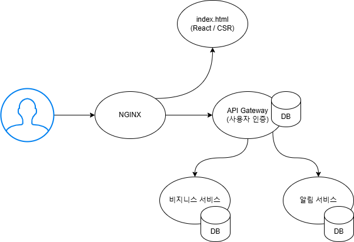

# 결정된 사항

- 1개의 프론트엔드 서비스
- 2개 이상의 백엔드 서비스(마이크로 서비스)
- 최초 마이크로 서비스간 통신 방법은 동기! (REST API)
- AWS EC2만 사용
- 최초에는 컨테이너 단위로 배포
  - EC2는 1대 또는 2대
- 오케스트레이션 환경 사용하지 않음 (쿠버네티스 x)
- 깃허브 최대 활용
  - Projects : 이슈 관리
  - Actions : CI/CD
- **4주 안에 설계 및 배포까지! (4월 10일에 웹 사이트 접속 가능)**
- 최초 배포 이후 점진적으로 확장
  - 쿠버네티스 설치, 메시지큐 사용 ...

# 공통 문서 작성

> 좋은 방법은 무엇인가?

## 프로젝트 운영

- 이슈 작성 규칙
- 이슈 관리 규칙

## 개발

- 코딩 규칙
    - 이름 규칙
        - 변수, 함수, 클래스, REST API ...
    - 주석 작성 규칙
    - 공통된 auto formatting 사용 방법
        - back, front
- 브랜치 전략
    - main, dev ...
    - 작업별 브랜치
- PR/코드 리뷰 규칙
    - 몇 명이 confirm 해야 merge 가능?
    - 좋은 코드 리뷰란?
- 테스트 코드 작성 규칙
    - 좋은 테스트 코드란?
    - 테스트 코드의 수준

## 배포

- 컨테이너로 실행하는 방법
  - Dockerfile 작성 방법
- 버전 관리
  - 어떤 버전 규칙을 사용할 것인가?
- 개발/운영 환경 관리
  - 어떻게 구분할 수 있나? (서버)
  - 어떻게 접속할 수 있나? (url)
- 자동 배포
    - dev 브랜치에 merge 되는 순간 배포?
    - main 브랜치에 merge 되는 순간 배포?
- 롤백
    - 배포된 버전에서 문제가 생겼을 경우 조치 방안

# 마이크로 서비스 정의 (파트별)

> 파트단위 문서는 파트 디렉토리에 작성

> 최소 기능 -> 점진적 확장

- 도메인별 마이크로 서비스 정의
  - 몇 개의 서비스(앱, 컨테이너)로 나눌 것인가?
- **SRS 작성**
  - **전체 구성, 주요 기능 ...**
- 기술 스택 결정
  - 개발 언어, 프레임워크, DB
- 통신 방법 결정
  - 동기, 비동기
  - REST API, GraphQL, gRPC, Message Queue ...)
- ERD 작성
- API Docs 작성

## 사용자 인증 파트

- API Gateway
- 인증 방식
  - 세션? 토큰?
  - 회원 가입?
  - ID/PW 로그인? 소셜 로그인?
- 인증이 실패하면?
  - 클라이언트에게 어떻게 응답?
- 인증이 성공하면?
  - 비지니스 마이크로 서비스로 어떻게 전달?
  - 마이크로 서비스에게 받은 응답을 어떻게 클라이언트로 전달?

## 관리자 기능 파트

- 알림 기능 먼저
  - 어떤 조건에 어떻게 알려줄 것인가?
- 이후에 모니터링, 관리자 기능(유저 정지, 댓글 가리기?)

## 서비스 기능 파트

- 기본적인 CRUD

# 다음주까지 해야하는 것

1. 각자 맡은 작업에 대한 작업 일지 작성 (2주차_제목.md)
2. 파트장이 파트원들의 item(Projects) 생성하여 작업 할당
   1. 스스로 해도 됨