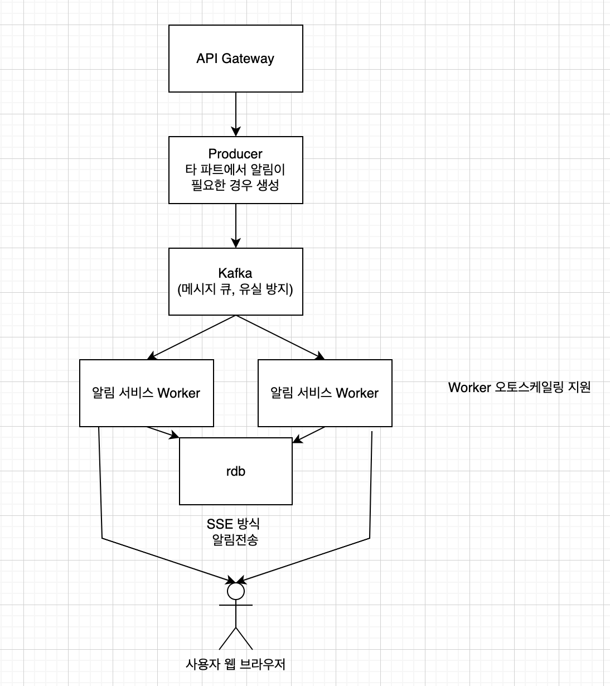

우리 파트의 관리자 기능은 크게 3가지로 나눌수있다.
알림 서비스, 관리자 서비스, 모니터링 서비스
3가지의 서비스들의 기능을 나열해보았다.

1. 알림기능
    2. 필수 알림
        3. 새로운 답변 등록(최소 기능)
        4. 답변 채택
        5. 댓글 알림
        6. 신고 처리 결과 알림
        7. 새로운 신고 발생 (관리자)
    8. 추가 알림
        9. 좋아요/추천 알림 – 자신의 답변에 좋아요(추천)가 달렸을 때
        10. 태그 구독 알림 – 구독한 태그의 새 질문이 올라왔을 때
        11. 질문/답변 검색 구독 – 특정 키워드(예: "Spring Security")와 일치하는 질문이 올라왔을 때
        12. 포인트 획득 알림 – 답변 채택 등으로 포인트를 획득했을 때
        13. 인기 질문 알림 – 하루 동안 특정 수 이상의 조회/추천을 받은 질문이 있을 때
        14. 최신 질문 알림 – 특정 카테고리의 최신 질문이 올라왔을 때
    2. 모니터링
        3. 실시간 통계 데이터 실시간제공
            4. 신규 질문/답변 수
            5. 신규 댓글 수
            6. 오늘 발생한 신고 건수
            7. 가장 많이 본 질문 (TOP 5)
            8. 가장 많이 채택된 답변 (TOP 5)
            9. 포인트 상위 사용자 (TOP 5)
            10. 최근 1시간 내 활동한 사용자 수
4. 관리자 기능
    4. 유저 관리
        5. 신고 누적 사용자 관리(경고, 일시정지, 차단)
    5. 신고된 게시글 삭제
        6. 신고 질문 삭제
        7. 신고 답변 삭제

더 많은 기능이 생기겠지만 일단 이정도로 생각하고 설계를 진행해보려 한다.
알림 -> 관리기능 -> 모니터링 순으로 설계를 진행해볼예정이다.

먼저 우선순위가 높은 알림서비스 이다.
알림 아키텍쳐를 결정하려면 어느수준까지 기능을 지원할것인지 선택이 필요하다.

- 고민거리
    - 알림 전달 방식
        - 실시간 or 배치
        - 3.17 파트회의 결정사항 (실시간)
    - 메세지 저장 방식
        - 유실 방지 할것인지?
            - 3.17 파트회의 결정사항 (메시지가 최대한 유실되지않도록)
    - 메세지 큐 선택
        - 3.17 파트회의 결정사항 (단일사용자 순서보장 , 대용량 처리 가능)
        - 메시지 순서를 보장해야하는가?
        - 대용량 알림(백만개 이상) 도 처리해야할수 있는가?
    - 알림 메시지 전송 실패시
        - 3.17 파트회의 결정사항 (실패한 알림 3번 재시도, 재시도3회 이상 실패시 로깅)
        - 실패한 알림을 몇번까지 재시도 할 것인가?
        - 재시도에도 불구하고 최종적으로 실패한 알림에 대해서는 어떻게 처리할것인가?
            - 재시도 전략
            - Dead Letter Queue
            - 알림 상태 저장 (Read Confirmation 등)
    - 확장성
        - 트래픽 증가 대처방법
            - 3.17 파트회의 결정사항 (트래픽이 증가할 경우 알림전송 worker 오토스케일링)
            - 오토 스캐일링
            - 캐시(redis) 사용
    - 알림 발송시 우선순위가 필요한지?
        - 3.17 파트회의 결정사항 (우선순위 필요없음)
        - 우선순위 큐 (Priority Queue) 사용
        - FIFO
    - 알림 전송 방식
        - 3.17 파트회의 결정사항 (실시간 전송 기술중 구현 난이도 고려하여 SSE 로 선택함)
        - 알림이 몇초안에 전달되어야 하는가?
        - 실시간성이 매우 중요한것인가?
            - 실시간 푸시 알림 (WebSocket, SSE, Firebase Cloud Messaging)
            - 지연 전송 (Batch, Polling)
    - 멀티 디바이스 & 플랫폼 지원
        - 3.17 파트회의 결정사항 (처음엔 브라우저만 지원.. 나머지는 추후진행)
        - 모바일 + 웹 푸시 + 이메일 동시 지원
        - 웹 기반 알림 (Notification API, WebSocket)
    - 중복 전송 방지
        - 3.17 파트회의 결정사항 (중복방지 안되도록)
        - kafka 설정 및 어플리케이션 레벨에서 unikey 사용하여 방지

최종적으로 결정된 사항들을 지원할수있는 아키텍쳐 사진이다.

- 

하지만 아직 병목이 발생할만한 지점이 많아 보완이 많이필요하다.
RDB에 많은 데이터가 한꺼번에 들어오면 병목이 될 수 있고
SSE 방식 특성상 서버와 클라이언트가 연결을 유지하기때문에 사용자가많아지면
메모리 점유율이 높아질수있다.
그러므로 worker 와 sse 서비스를 분리하고 중간에 redis pub/sub 을 넣는것도
괜찮아보인다.

고민거리
알림 받을 대상을 누가 정해야할까?
3.17 파트회의 결정사항 (알림받을 대상은 알림서비스 에서 정한다.)

- 알림을 받을사람은 kafka 컨슈머(알림서비스)가 정한다. 이를위해
  질문아이디, 답변아이디 등을 kafka 파라미터로 받는다.
  그리고 질문/답변 게시판의 데이터를 알림을 받을사람을 조회할수있을만큼의 최소한의
  데이터를 중복저장한다.

- kafka 프로듀서
    - 알림 사용하는 파트에서 누구에게 보낼지를 조회해야하기때문에 타 파트 로직이 복잡해짐
- kafka 컨슈머
    - 알림 보낼사람을 재 조회 해야함(db or 타 시스템 api)
