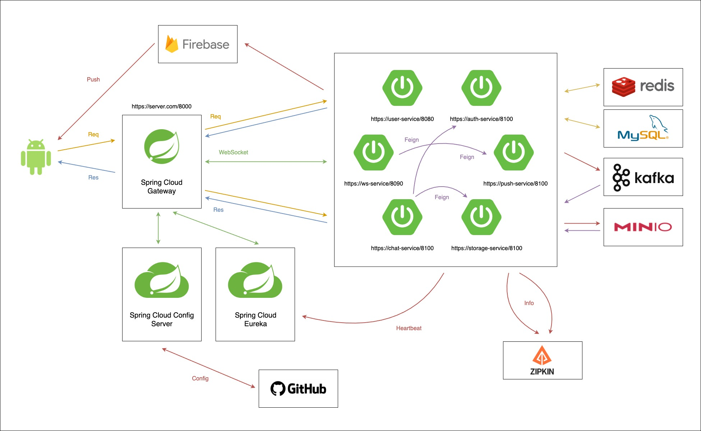
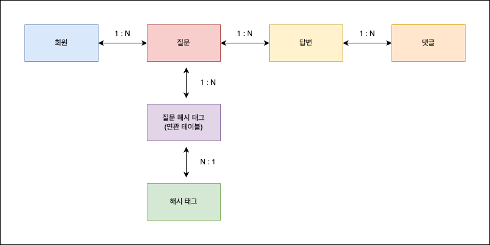

# 프로젝트 설계

본문서는 진행할 프로젝트의 설계 내용에 대해서 작성되었습니다.  

## 1. 요구 사항 정리 & 분석

### 1.1. 기본 요구 사항
* 최소 기능
    * 질문 작성 및 수정 (사용자가 질문을 작성하고 수정)
    * 답변 작성 (질문에 답변 작성)
* 추가 기능:
    * 답변 채택 기능 (질문에 답변을 채택할 수 있음)
    * 질문/답변 검색 (제목만 검색)
    * 답변에 댓글 작성 (답변에 대한 댓글 기능)
    * 질문/답변 신고 기능 (부적절한 질문이나 답변 신고)
    * 태그 기능 (질문에 태그 추가)
    * 좋아요/추천 기능 (답변에 좋아요 기능 추가)
    * 질문/답변 필터링 및 정렬 (최신, 인기 등으로 정렬)
    * 리워드 및 포인트 시스템 (답변 채택 시 포인트 지급)

### 1.2. 요구 사항 분석
* 질문 & 답변에 대한 읽기 기능은 모든 사용자가 가능
* 질문 & 답변에 대한 쓰기 기능은 사용자 인증이 완료된 이후에 가능
* 질문은 코어 데이터로 모든 데이터는 질문을 중심으로 구성된다. (우선은 회원은 제외)

### 1.3. 요구 사항 분석 및 설계

질문 : 답변은 1대다의 관계를 가진다.
* 질문과 답변은 상태를 가진다.
    * 질문 - 신규, 진행중, 완료
    * 답변 - 채택, 미채택

답변 : 댓글은 1대다의 관계를 가진다.   
- 답변의 댓글에 대해 대댓글 기능은 가능 하면 지원하도록 한다.   

질문 : 해시 태그(태그)는 다대다의 관계를 가진다. (단 1대다, 다대1로 처리한다)   
- 해시 태그를 통한 질문 모아보기 기능등을 제공한다.  

질문은 페이징 처리 & 검색 & 정렬의 기능을 제공한다.  

- 검색은 질문 제목, 질문 내용, 질문 작성자로 검색 가능
- 정렬은 날짜순, 답변 많은순, 추천순 등을으로 정렬한다.

## 2. 아키텍쳐 설게

### 2.1. MSA (Micro Service Architecture)

위의 구조는 참고용 MSA 구조이다. (Hexagonal architectur)  
플랫폼 서비스/기능 서비스/인프라를 구분해서 보도록 한다.  

### 2.2. 질문/답변 서비스의 구성

구동 플랫폼의 사양을 정확히 측정 하기 어려우므로 최초 서비스 구성은 질문/답변 서비스 하나로 구성한다.  
질문 답변의 기본 스펙인 인증된 사용자만 write가 가능  
회원 서비스와 질문/답변 서비스는 분리 하기로 결정한다.

같은 DB를 사용한다고 하면 별도의 요청없이 회원의 정보 조회가 가능  
그러나 회원 서비스는 회원 DB를 사용하고   
질문/답변 서비스는 질문/답변 DB를 사용하는 경우를 고려 해야한다.   
그래야 회원 서비스에 장애가 발생하더라도 질문/답변 서비스는 정상 동작 한다.  

여기서 두가지 방법이 필요하다.
1. 질문/답변 서비스에서 회원 서비스의 정보를 조회한다.
2. 질문/답변 서비스에 회원 정보를 중복으로 저장한다. (필요한 정보만 저장)

1은 필요에 따라 요청을 통해 데이터를 전달받는다.  
2에서 중복 데이터를 관리하는 방법은 회원 정보의 변경이 발생하는 경우   
회원 서비스 -> 질문/답변 서비스 데이터 변경 이벤트를 발생시키는 것이다. (ex. 메세지 큐, CDC)  
질문/답변 서비스는 해당 이벤트를 구독하고 있다가 필요한 정보만 갱신 하여 동기화 한다.  
단, 이방법은 이벤트 발생 시점까지 데이터 동기화 완료까지 시간이 필요 할 수 있다.   

### 2.3. 플랫폼 서비스 구성

* API Gateway
    * FE/BE간 모든 통신은 API Gateway를 거친다.
    * 모든 인증은 API 게이트 웨이에서 처리한다.  
    * Jwt를 이용한 sessionless한 인증을 사용한다.
    * 스케일 아웃된 상황에서 Service Discover를 통해 로드 밸런싱 수행
    * Rate Limit을 이용한 부하 방지 & 플랜별 api 한도 재한
* Service Discovery
    * API 게이트 웨이등에서 각 서비스의 정보를 조회
    * 각 서비스느는 Discovery로 자신의 정보를 전송한다.
* 스토리지 서비스
    * 서비스 전체의 파일 업로드, 다운로드를 수행한다.
    * s3, minio같은 확장, 복구, 클러스터 구성이 가능한 인프라를 이용한다.  
* Config Service
    * 각 서비스에서 사용하는 설정 정보를 저장
    * 설정 정보 변경시 actuator를 이용해 각 서비스에 변경 내용을 전파

### 2.4. 기타 서비스

* 백오피스
    * 관리자만 접근 가능한 서비스로 기능 서비스에서 수행이 불가능한 작업을 수행한다.  

## 3. 데이터 베이스 설계

### 3.1. 테이블간 연관관계 및 설계 정리

질문 : 답변은 1대다의 관계를 가진다.
* 질문과 답변은 상태를 가진다.
    * 질문 - 신규, 진행중, 완료
    * 답변 - 채택, 미채택

답변 : 댓글은 1대다의 관계를 가진다.   
- 답변의 댓글에 대해 대댓글 기능은 가능 하면 지원하도록 한다.   

질문 : 해시 태그(태그)는 다대다의 관계를 가진다. (단 1대다, 다대1로 처리한다)   
- 해시 태그를 통한 질문 모아보기 기능등을 제공한다.  

질문은 페이징 처리 & 검색 & 정렬의 기능을 제공한다.  

- 검색은 질문 제목, 질문 내용, 질문 작성자로 검색 가능
- 정렬은 날짜순, 답변 많은순, 추천순 등을으로 정렬한다.

인덱스 전략
- 기본키 활용
- 서비스의 특성과 카디널리티를 비교하였을때 추가 인덱스를 통한 쿼리 튜닝 진행 (예정)

### 3.2. ERD

### 3.3. 테이블 연관관계

