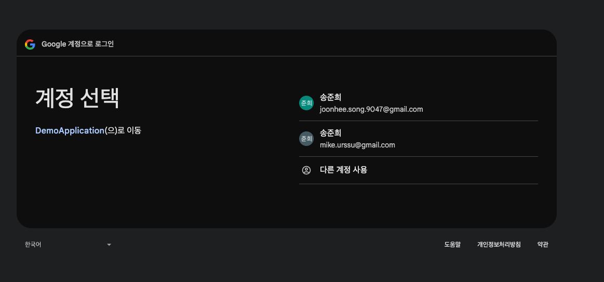
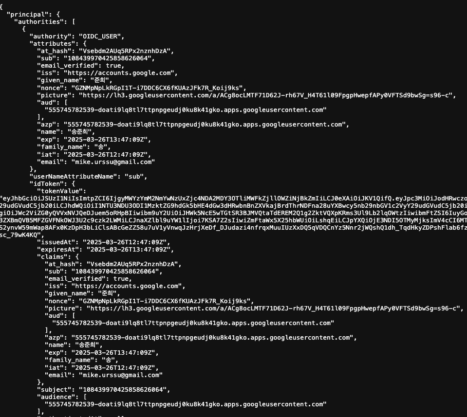

# OAuth 등장 배경

어떤 서비스에서는 사용자를 대신해 구글 캘린더에 일정을 추가하거나 페이스북에 글을 남기는 등의 기능을 제공할 수 있다.  
이 기능을 가장 쉽게 구현하는 방법은 사용자로부터 구글, 페이스북의 ID, Password를 직접 제공받아 우리의 서비스에 저장하고 활용하는 것이다.  
하지만 서비스에 보안 문제가 발생해 사용자 정보가 유출되면 큰 피해가 발생할 수 있고  
서비스 입장에서는 사용자의 민감한 정보를 직접 저장하고 관리해야 하는 부담이 생길 것이다.

이 문제를 해결하기 위해 **OAuth**가 등장했다.

# OAuth란?

구글, 페이스북 같은 다양한 플랫폼의 특정 사용자 데이터에 접근하기 위해 제 3자 클라이언트(서비스)가 사용자의 **접근 권한을 위임**받을 수 있는 표준 프로토콜이다.

# OAuth 구성

1. Resource Owner  
   우리의 서비스를 이용하면서, 구글, 페이스북 등의 플랫폼에서 리소스를 소유하고 있는 사용자

2. Authorization Server  
   Resource Owner를 인증하고 Client에 Access Token을 발급해주는 서버

3. Resource Server  
   구글, 페이스북과 같이 리소스를 가지고 있는 서버

4. Client  
   Resource Server 자원을 이요하고자 하는 서비스 // AOF

# OAuth 동작 원리

# 실습

## 사용자가 서비스에 로그인 요청

사용자가 Google Login 버튼을 통해 서비스에 로그인 요청을 한다.

## 서비스가 Google로 로그인 요청

## Google이 사용자에 로그인 페이지 제공

## Google에 로그인

사용자가 Google 로그인하면 Spring Boot가 자동으로 Google에 사용자 정보를 요청한다.

## 결과 확인

