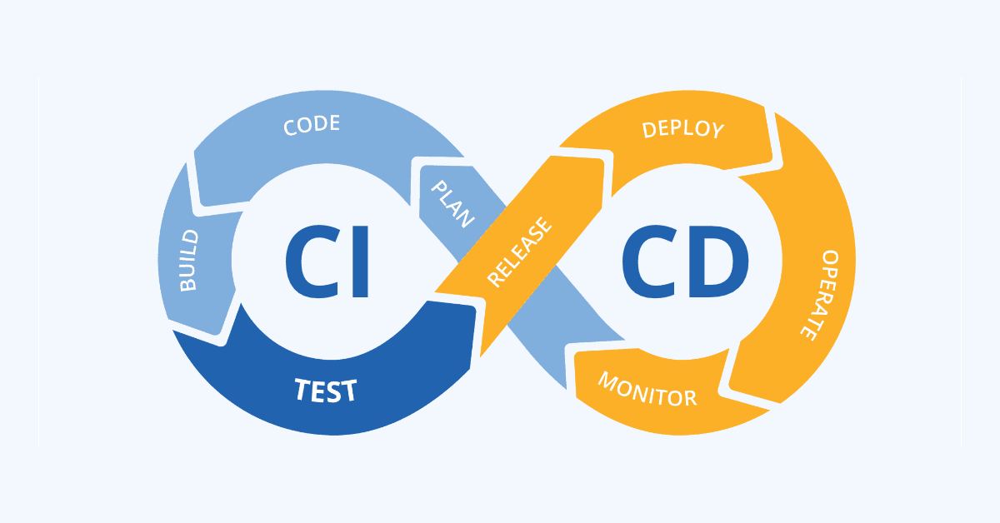
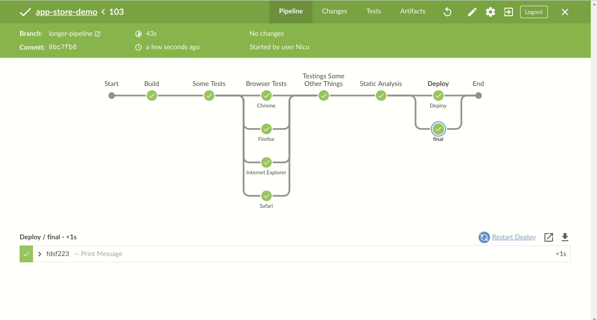
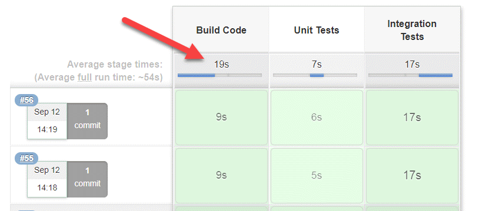
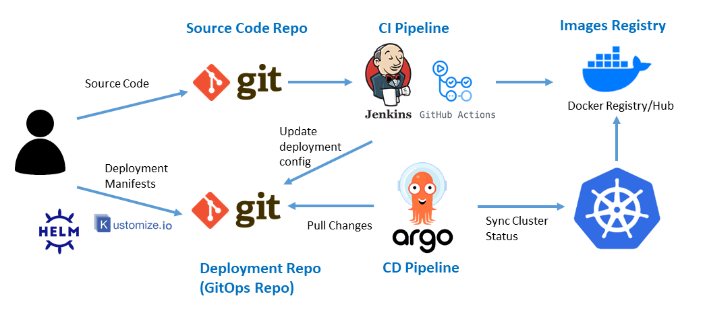
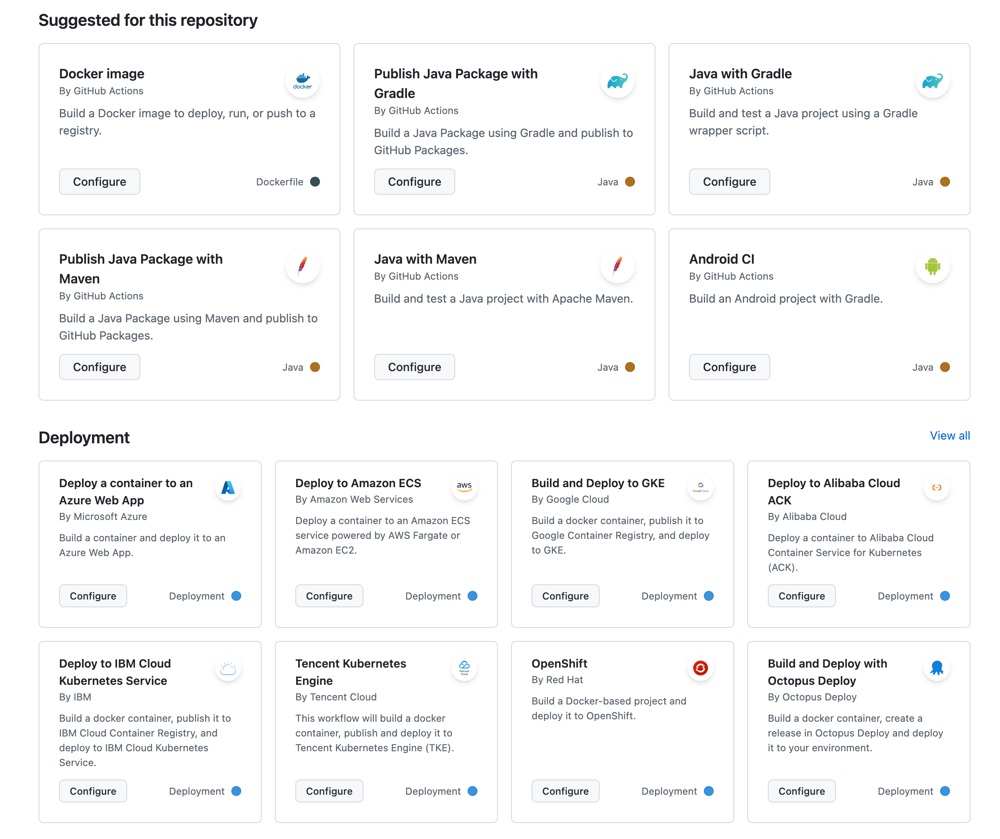
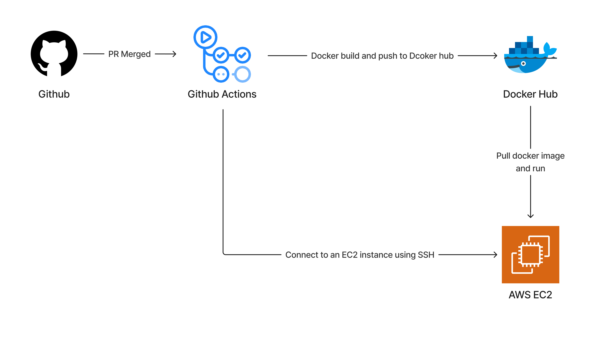

## CI/CD and Rollback 에 대해서

### 1. CI/CD 가 무엇인가?

`CD` 지속 적인 배포 - 배포 자동화 과정   
`CI` 빌드/테스트 자동화 과정  

### 2. 왜 해야 하는가?

배포는 IT 서비스의 가장 중요한 부분중 하나 입니다.  
배포가 잘못되면 서비스가 제대로 작동하지 않을 수도 있기 때문입니다.  

기존의 모놀리식 구조에서는 비교적 간단한 절차의 배포가 가능했습니다.  
하지만 MSA가 등장하고 서비스의 구조가 복잡해졌고,   
그에따라 빌드 프로세스도 간단해지지 않게 되었습니다.  

서비스의 복잡도가 올라가면서 빌드/테스트에도 큰 변화가 있었습니다.   
MSA에서는 서비스가 최소한의 기능 단위로 분리 됨에 따라 단일 서비스만 배포도 가능 해졌습니다.  

이때 등장한게 바로 CD/CI 즉, 지속적인 통합, 지속적인 배포 입니다.   
서비스가 복잡하면 MSA를 구성하는 서비스가 많아 지고 이에 따라 배포 시점이 따로 정할 수 없는 경우가 많습니다.   
서로 개발 주기도 다르고 배포 주기도 다르게 갖고 있기 떄문입니다.  

MSA를 구성하는 수많은 서비스를 수정 시점 마다 매번 빌드/테스트/배포를 할 수 없습니다.  
따라서 자동화를 통해 서비스 배포 프로세스를 구축한다면 서비스를 지탱할 수 있게 됩니다.  

### 3. 어떻게 하는 게 좋은 것인가?

우선은 서비스를 구성하는 개발 프로세스에 대한 이해가 있어야 한다고 생각합니다.  
서비스의 배포가 얼마나 이뤄져야 하는지, 배포 과정이 어떻게 되는지를 파악하고  
자동화 할 수 있는 부분을 찾는게 우선이라고 생각합니다.  

서비스 특성을 고려하여 추가되어야 하는 작업을   
어느 구간에 어떻게 처리하도록 할것인지에 대한 고민도 필요합니다.   

### 4. 어떤 환경에서 해야하는가?

빌드 서버의 경우 별도의 인프라가 있다면 빌드 서버를 구축해도 좋지만,  
별도의 구축이 필요없는 서비스들도 존재합니다.  
젠킨스의 경우 서버 장비가 존재하면 구축하면 좋을것같고,  
깃허브 액션의 경우 별도의 서버 장비가 없다면 사용하는게 좋다고 생각합니다.  

또한 빌드/테스트 환경은 최대한 실 환경과 격리되어야 하며  
최대한 동일한 환경 즉, 물리적으로 분리된 가상의 환경이지만   
실제 환경에 가장 가깝게 만드는게 좋습니다.   

테스트로 인한 결과가 실제 서비스와는 무관하게 이뤄져야 하며  
실제 환경과 되도록 비슷하게 구성하여 올바른 테스트가 이뤄져야 합니다.   

### 5. 어떤 방법으로 가능한가?

CD/CI는 devops라는 직군이 생겨나면서 정말 많은 툴들이 존재합니다.  
툴을 무작정 사용하기 보다는 각각의 툴이 가지는 장점, 단점을 체크 해보고 사용하는게 좋을것같습니다.  
대표적으로 깃허브 액션과 젠킨스중 어떤것이 유리할까를 고민해보고 적용하는게 좋아 보입니다.   

배포 방법의 경우 다운타임을 허용하는지, 아니면 다운 타임을 허용하면 안되는지 등을 체크하고  
다운 타임을 허용안하는 경우에는 롤링 업데이트를 통해 서비스의 다운 없이 구성하는게 좋습니다.  

또한 가능하다면 배포 과정에서 의존성을 제거하여 A, B작업이 개별로 이뤄질수 있도록 해야 합니다.  
의존성을 제거 할수 없다면 공통화 하는 방안을 마련 해야 합니다.  

예를 들어 DB를 사용하는 서비스의 경우 DB스키마가 변경되면   
서비스는 DB의 의존관게를 띄게 됩니다.   
스키마 변경이 이뤄지지 않은 상태에서 서비스 배포가 이뤄진다면 이는 곧 장애로 이어집니다.  
따라서 배포 단계에 DB의 의존 관계를 띄는 경우 DB스키마 작업을 프로세스에 꼭 넣어서 구성을 해야 합니다.    

### 6. 우리는 어떻게 배포해야 하는가?

서비스 개발 주기에 따라 자동화 방식을 통해 자동적으로 배포가 가능하도록 하는게 좋습니다.  
즉, CD/CI 환경읉 통해 개발 이후의 과정의 자동화를 통해 배포 해야 합니다.  

### 7. 어떤 조건에 의해서 배포되어야 하는가?

프로세스가 만일 개발/빌드/테스트/배포의 단계로 이뤄졌을때   
각 단계가 완료된 뒤 검증을 통해 다음 단계로 넘어가는 것이 중요하다고 생각합니다.  
예를 들어 개발이 완료된 시점에 빌드가 이뤄져야 합니다.  
빌드가 완료된 시점에는 산출물이 나와야 하빈다.  

VCS에서는 다양한 방법을 통해 다음 단계로의 진행을 지원합니다.  
대표적인 에시가 트리거와 같은 방법입니다.   

또한 각 단계에서 실패에 대한 인지를 알 수 있어야 합니다.  
이 역시 웹훅, 알림을 잘 구성하여 어떤 단계에서 어떤 오류가 발생 헀는지를  
쉽게 알고 대처 할 수 있는것이 가장 중요 합니다.  

### 8. 얼마나 자주 배포 되어야 하는가?

MSA에서 배포 단위는 서비스별로 상이 하기 때문에  
서비스의 특성을 잘 파악하는게 중요합니다.  
자주 배포되어야 하는 경우도 있을수 있고, 초기 배포 이후 쉽게 변하지 않는 경우도 있습니다.  
주로 기능 단위 서비스가 전자이고, 인프라 관련 기능을 하는 서비스가 후자에 속합니다.  

### 9. 배포시에 문제가 발생했을 경우 어떻게 대처할 수 있는가?

모니터링 시스템 구축이 필수적이라고 생각합니다.  
배포 이후 어떤 서비스에서 어떻게 에러가 발생하였는지를 구축한다면  
배포 이후 발생하는 장애를 최대한 빠르게 대처 할 수 있습니다.  

또한 잘못된 배포로 인한 경우 이를 검증할수 있는 방안을 검토 해야 합니다.  
예를 들어 변경된 사항이 없는 동일한 서비스가 배포 된다면 검증 과정의 문제 입니다.  

하지만 우선 잘못된 배포로 인한 장애가 아니라면 배포 전 과정에서의 실수가 무엇인지를 우선적으로 확인 해야 합니다.  
검증 로직의 문제 인것인지, 정책에 따른 문젱 인것인지 파악 해야 한다고 생각합니다.  

### 10. 어느 수준까지 자동화할 수 있는가?

개발 이후 빌드는 환경에 따라 다르겠지만,  
일반적인 환경에서는 빌드, 배포의 경우 100% 자동화가 가능합니다.   

하지만 테스트의 경우는 좀 다른데, BVT의 경우 서비스의 특성에 따라 범위를 나눠야 하며,  
이 나눠진 범위에 따라 자동화의 여부가 다를것 같습니다.  

### 11. 여러개의 마이크로 서비스 배포를 어떻게 효율적으로 관리할 수 있는가?

젠킨스 또는 깃허브 액션등의 인프라를 이용하여,  
빌드 파이프 라인을 통해 서비스의 빌드 자동화 과정을 수립 할 수 있으며  
빌드의 각 스테이지에서 어느 부분에 대한 오류인지를 쉽게 알 수 있습니다.  
또한 서비스 뿐만 아니라 다양한 IaC 툴을 통해 인프라까지도 관리 할 수 있습니다.  

### 12. 깃허브 액션은 어떤 기능을 가지고 있는가?

다양한 기능이 존재하지만  
깃허브 레포지토리에서 발생하는 다양한 이벤트를 기반으로 직접 원하는 플로우를 구성하는 것이 장점이라고 생각합니다.   
또한 다양한 배포 형태, 방법을 제공 하므로 서비스 특성에 맞게 구성이 가능하다는 장점이 있습니다.   

### 13. 우리는 어떻게 깃허브 액션을 활용할 수 있는가?

